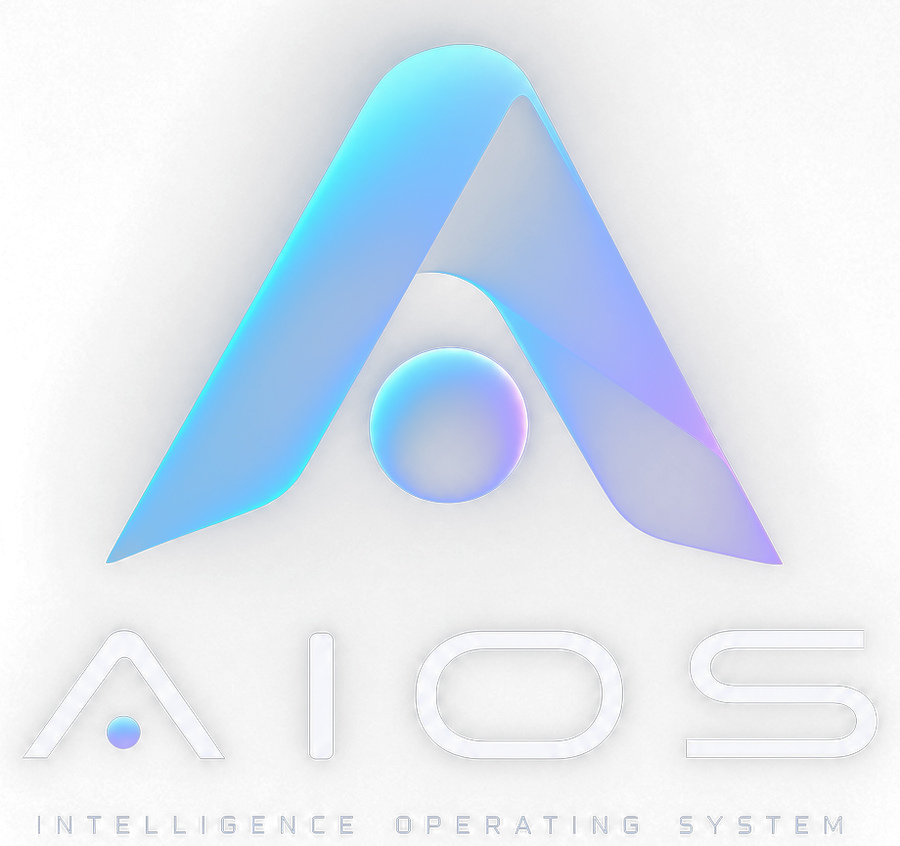

<p align="center">
  
</p>

<p align="center"><b>A Linux appliance that runs AI models on your own hardware — CPU or GPU.</b><br>
No cloud, no account, no container stack: an ISO, a disk and a browser.</p>

---

AIOS turns an x86-64 machine — bare metal or a virtual machine — into a self-contained appliance for running open-weight models locally. You install it from an ISO, open a browser, pick a model from a curated catalogue, and chat with it or call it from your own tools through an OpenAI-compatible API.

Everything runs on the machine you installed it on. Nothing is sent anywhere, and the appliance works without Internet access once the models are downloaded.


## What you get

- **Guided installer.** Boots under BIOS and UEFI, asks only what it needs, checks every answer as you type it and installs in a few minutes.
- **Administration portal.** Hardware, catalogue, downloads, runtimes, users and roles, audit, network, TLS, backups and signed component updates — all from the browser, no shell involved.
- **Model catalogue that stays current.** Repositories track the newest GGUF releases from trusted publishers instead of a fixed list, and list only files this appliance can actually run.
- **Any GPU, automatically.** NVIDIA, AMD and Intel, discrete or integrated, are detected at boot and used through Vulkan; without one, or if the GPU cannot load a model, the model runs on the CPU. Nothing to configure.
- **Generates pictures too.** From version 1.5 a second engine runs diffusion models (Stable Diffusion, SDXL, FLUX) on the same hardware, with an OpenAI-compatible image endpoint and a button in the chat. [Image generation](docs/image-generation.md)
- **Vision models see images.** A model's vision projector is found, downloaded and loaded with it, so Qwen-VL, Gemma 3 and other multimodal models read the images you send in the chat.
- **Honest compatibility.** Every model shows its estimated RAM and a rating (OPTIMAL … INCOMPATIBLE) with the reasons behind it, before you download gigabytes.
- **Chat included.** Open WebUI shares the AIOS account; there is no second login.
- **OpenAI-compatible API** on port 443 for n8n, scripts or any OpenAI client.
- **Closed by default.** No shell on the console, no login on other terminals, locked boot entries, optional recovery SSH limited to the bootstrap code and the API key, and every console action behind an administrator password.

[See the full walkthrough with screenshots →](docs/demo.md)

## Get it running

1. Download every `aios-installer-x86_64.iso.part-*` file and `aios-installer-x86_64.iso.sha256` from the [latest release](https://github.com/danieleghione/aios/releases/latest). The 3.3 GB ISO is published in parts of up to 600 MB; join them in order and verify the result:

   ```bash
   cat aios-installer-x86_64.iso.part-0* > aios-installer-x86_64.iso
   sha256sum -c aios-installer-x86_64.iso.sha256
   ```

2. Boot it on a machine with an x86-64 CPU, at least 4 GiB of RAM (plus whatever the model needs) and a 16 GiB disk, or attach it as a CD/DVD to a VM. [Proxmox instructions](docs/proxmox.md) · [PC and other hypervisors](docs/install.md)
3. Answer the guided installer and let the machine reboot.
4. Open `https://IP/admin/`, create your administrator account with the one-time code shown on the console, enable a repository, install a model, publish and start it.
5. Open the chat from the header, or call `https://IP/v1/chat/completions` from your own tools. For pictures, enable the *Image models (diffusion)* repository and install one: [image generation](docs/image-generation.md).

## Requirements

|  | Minimum | Comfortable |
|---|---|---|
| CPU | x86-64, any Intel/AMD | 4+ cores with AVX2 |
| RAM | 4 GiB | 16 GiB or more — the model must fit in memory |
| Disk | 16 GiB | 100 GiB or more for several models |
| GPU | none | any Vulkan-capable GPU: NVIDIA (GTX 900 / Maxwell and newer), AMD Radeon, Intel Arc or a recent integrated GPU |
| Firmware | UEFI or legacy BIOS, Secure Boot disabled | |

Inference runs on the GPU when there is one and on the CPU otherwise. A 1B model answers on a small VM; a 30B model needs a machine — or a GPU — sized for it. [How GPUs are used](docs/gpu.md)

## Documentation

| | |
|---|---|
| [Demo](docs/demo.md) | The whole flow, with screenshots |
| [Install](docs/install.md) · [Proxmox](docs/proxmox.md) | Getting it onto hardware or a VM |
| [Administration](docs/admin-guide.md) | Daily use, roles, system settings |
| [Models and runtimes](docs/model-management.md) | Lifecycle, context, reasoning budget, what the catalogue lists |
| [GPU acceleration](docs/gpu.md) | Supported GPUs, drivers, passthrough, fallback to the CPU |
| [Image generation](docs/image-generation.md) | Diffusion models: families, installation, speed, limits |
| [Repositories](docs/repositories.md) | Providers, discovery, manifests |
| [API](docs/api.md) | Control plane and OpenAI-compatible endpoints |
| [Security](docs/security.md) | Trust boundary, console lockdown, shared identity, recovery SSH |
| [Network](docs/networking.md) · [Backup and restore](docs/backup-restore.md) | Operations |
| [Architecture](docs/architecture.md) · [Design notes](docs/design.md) | How it is put together and why |
| [Build](docs/build.md) · [Development](docs/development.md) | Building the image and the ISO from source |
| [Verification](docs/verification.md) | What is tested, and how to reproduce it |
| [Troubleshooting](docs/troubleshooting.md) | When something does not behave |

## Build it yourself

```bash
./scripts/setup-host.sh
make test
make iso     # dist/aios-installer-x86_64.iso
```

An Ubuntu 24.04 host with sudo, 6 GiB of RAM and 30 GiB free. The build compiles llama.cpp from a pinned commit with its CPU and Vulkan backends, installs Open WebUI, and produces a raw image and an installer ISO with checksums and a build inventory. [More in the build guide](docs/build.md).

## Licence and third-party components

AIOS itself is released under the [MIT licence](LICENSE). It bundles other projects under their own terms — Ubuntu, llama.cpp (MIT), Open WebUI and the Python/Node dependencies — and keeps their branding and notices intact. See [THIRD_PARTY_NOTICES.md](THIRD_PARTY_NOTICES.md).

Model weights are not included and are not covered by this licence: check the licence of each model you install.
