# Demo: from an empty disk to a local chat

Every screenshot below comes from a real appliance installed from the released ISO on a 2-core, 3 GiB virtual machine, the smallest configuration the project supports.

## 1. Boot the installer

The ISO boots under BIOS and UEFI. The first entry starts by itself after five seconds; the second one is for a serial console.

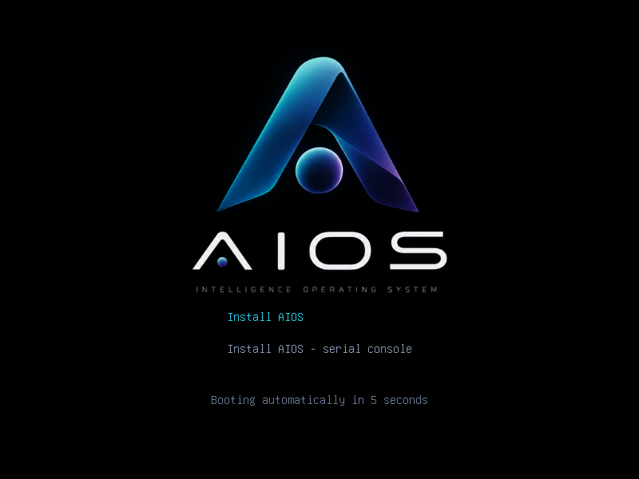

## 2. Answer the guided installer

No menu to find, no shell: the installer lists the disks it can use, proposes the first one and asks for language, keyboard, hostname, network, time zone, clock and optional recovery SSH.

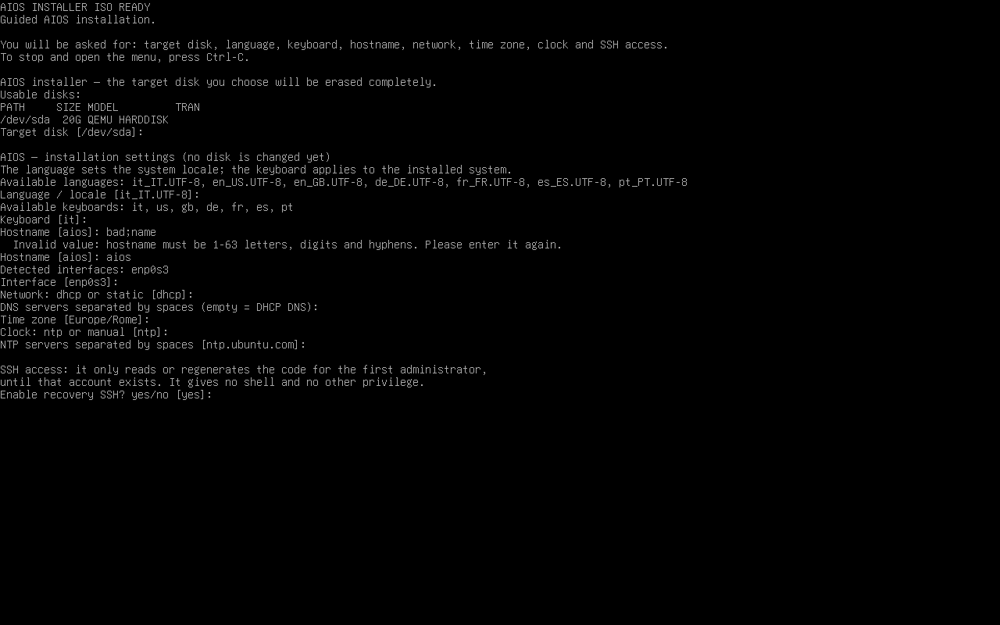

Each value is checked as you type it. A wrong value is explained and asked for again on its own — nothing typed before it is lost:

```
  Invalid value: hostname must be 1-63 letters, digits and hyphens. Please enter it again.
Hostname [aios]:
```

Once you confirm the summary, the disk is erased and the system is installed in five steps — usually a few minutes — and the machine reboots by itself.

## 3. First boot

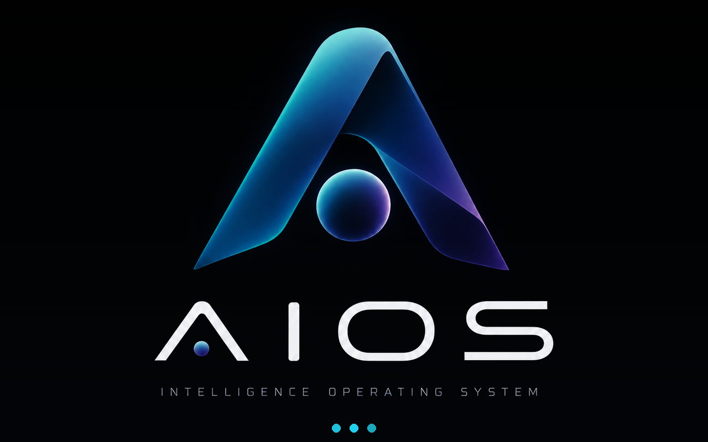

The console then shows the address, the URLs and a one-time bootstrap code, valid 24 hours:

```
AIOS READY
Hostname: aios-lab
IP: 192.168.1.50
User portal: https://192.168.1.50/
Admin portal: https://192.168.1.50/admin/
Admin bootstrap secret (valid 24h): X1fFQ9gGCaTFe9GOY0fwaAeQe44ukv3HWGwdqco5zvg

Updates: not checked yet.

AIOS local console
1) Show network and service status
2) Regenerate the bootstrap code (only while no administrator exists)
3) Check and install system updates
4) Reboot
5) Power off
6) Show API key for external tools (n8n, OpenAI clients)
```

There is no shell behind that menu, and every entry asks for an administrator password once one exists.

## 4. Create the administrator

Open `https://IP/admin/` and use the bootstrap code to create your own account. That code is then consumed.

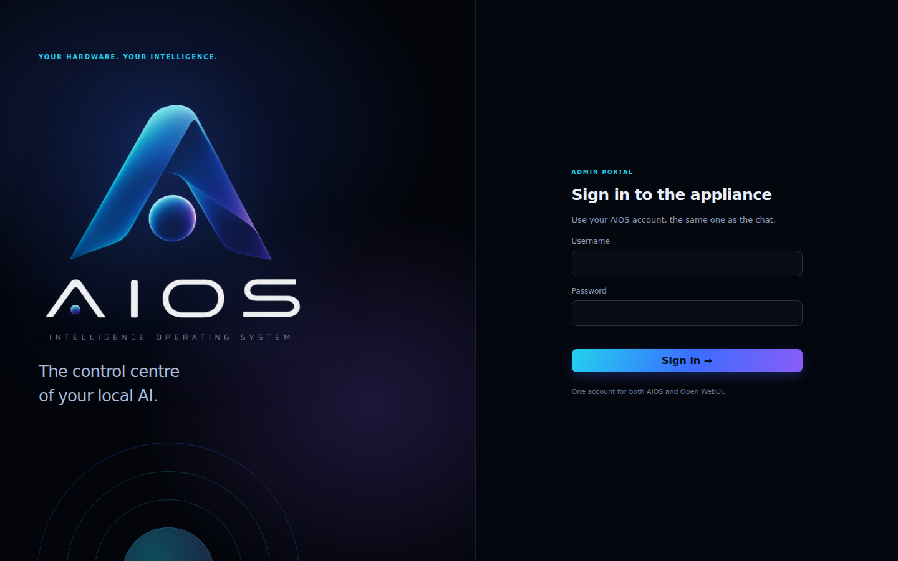

## 5. The appliance at a glance

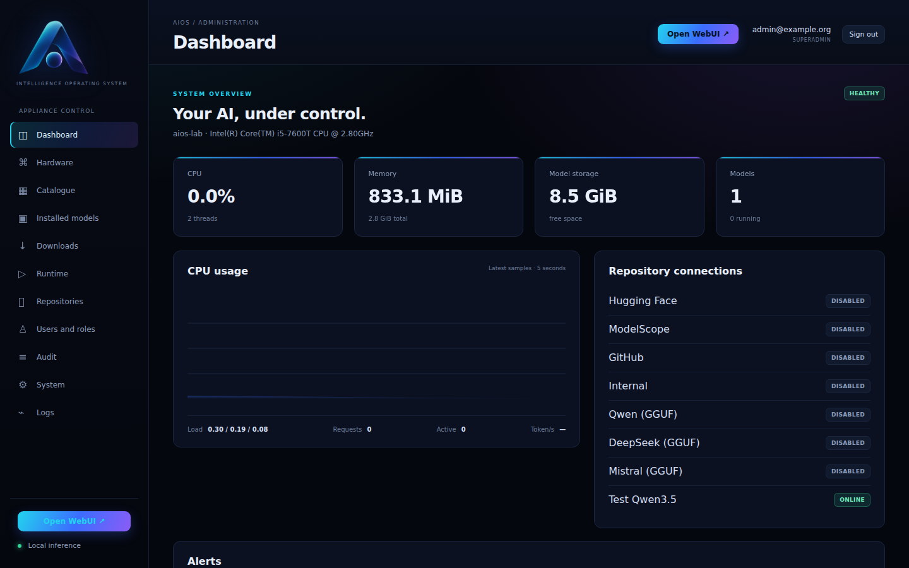

CPU, memory, model storage, the number of models, a live CPU chart and the state of every repository.

## 6. Check the hardware and the GPU

**Hardware** shows what the models will run on. The *GPU acceleration* card lists every GPU AIOS can use — NVIDIA, AMD or Intel, dedicated or integrated — with its memory and driver, and marks the ones models use. The lab VM in these screenshots has no GPU, so the card says models run on the CPU; on a machine with one, or with a GPU passed through to the VM, it appears here without any configuration. Below it: CPU model and instructions, NUMA, memory, storage and the calibration benchmark.

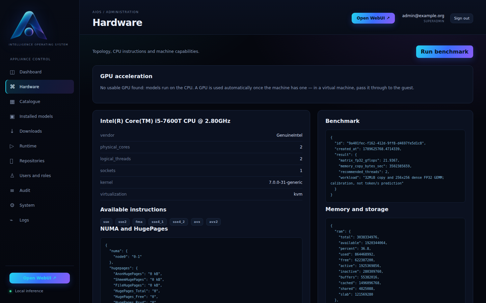

## 7. Enable a model repository

Repositories ship disabled. One button enables a repository and tests the connection; *Synchronise* then fetches metadata only — no weights.

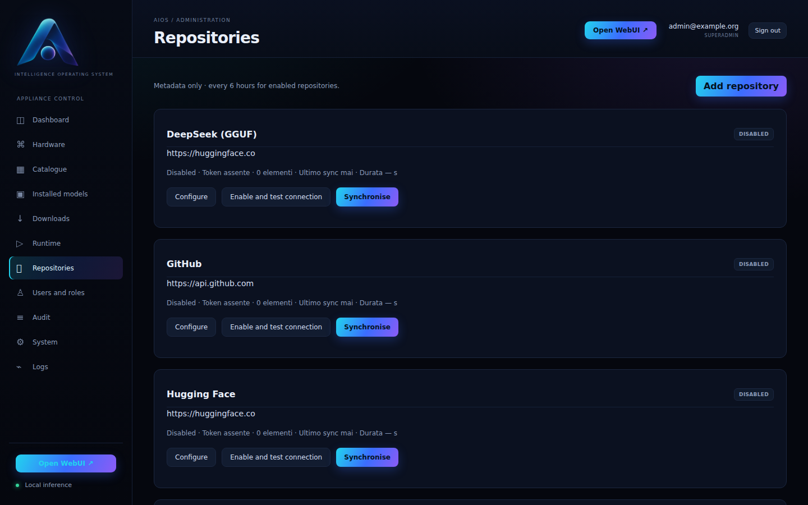

## 8. Pick a model

The catalogue lists the newest releases first and only files this appliance can actually run. Filter by text, by the period in which a model was found, and by how well it fits this machine (OPTIMAL … INCOMPATIBLE); every page is reachable.

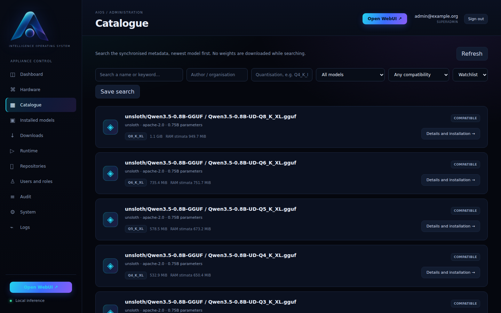

Before installing, the details panel shows licence, architecture, quantisation, size, the estimated RAM and the reasons behind the rating. You accept the licence explicitly. Models that can read images are marked *IMAGE INPUT*: their vision projector is downloaded with them, and pictures sent in the chat are understood.

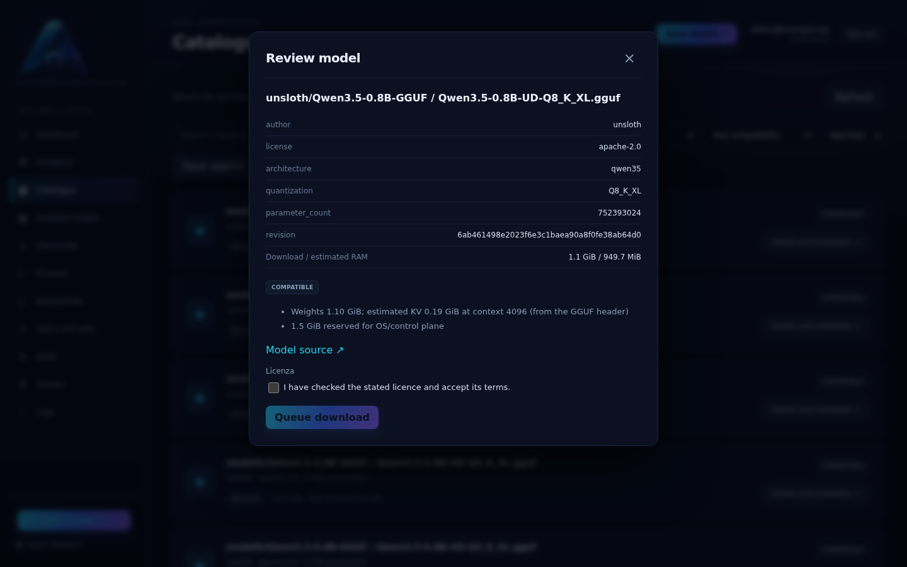

## 9. Publish and start

After the download, publish the model and start it. The card shows STOPPED, STARTING or RUNNING, and the button offers the opposite action.

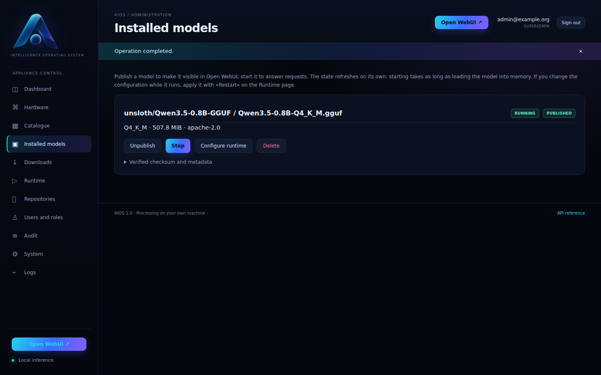

The Runtime page shows the process, where the model runs — *Running on the CPU*, or the GPUs it uses — the context actually in use — the default asks for 101024 tokens and is reduced to what the model declares and the RAM allows — and the llama.cpp log.

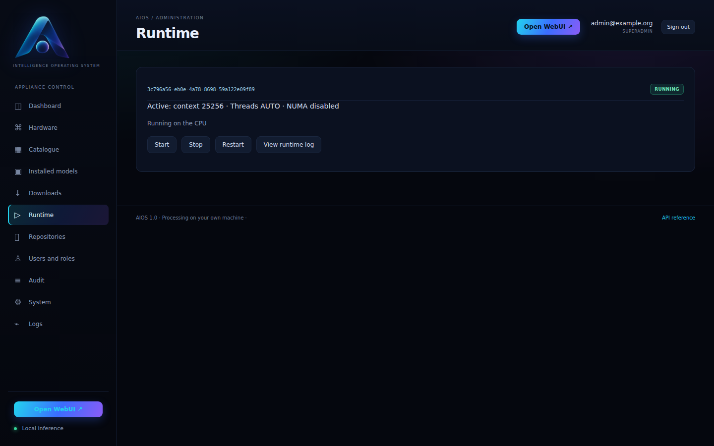

## 10. Chat

Open WebUI uses the same AIOS account; the published model is in its selector.

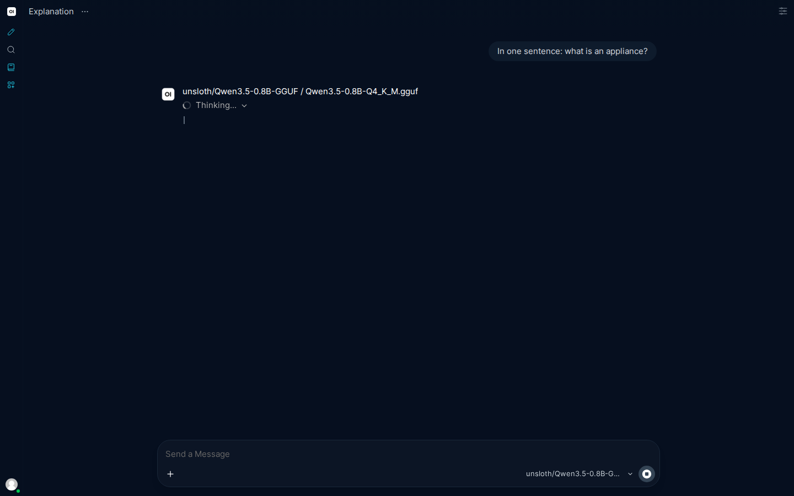

## 11. Generate pictures

Image generation does not go through Open WebUI's model list: diffusion models answer a different endpoint, so the portal has its own page for them. Enable **Image models (diffusion)** under Repositories, synchronise, and the catalogue lists them marked *IMAGE MODEL*, with the components each one needs and the memory the machine would have to give it.

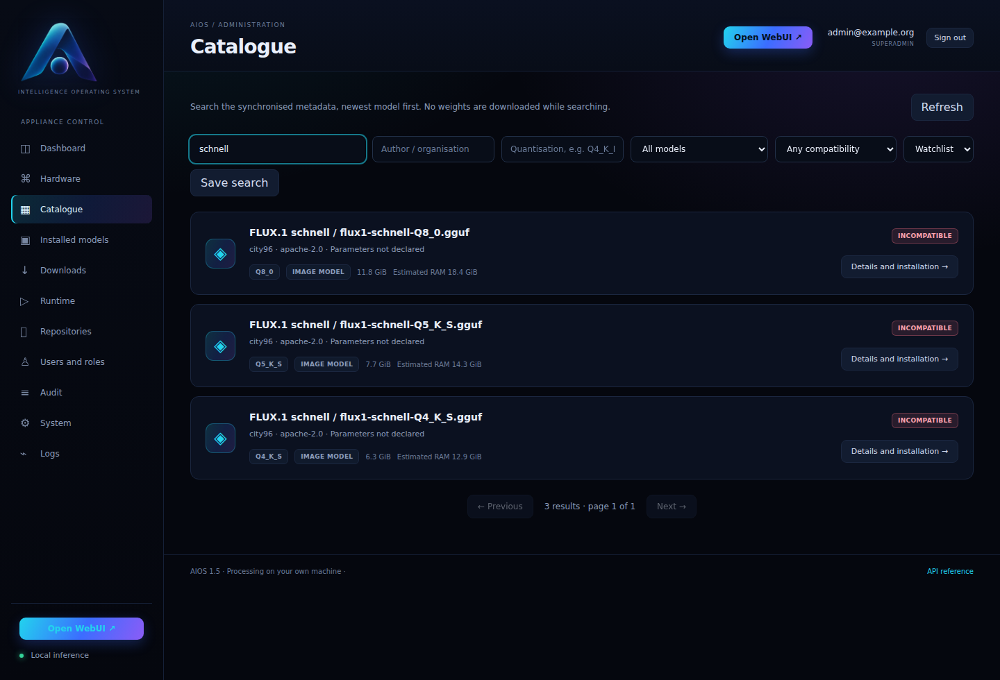

Install one and publish it. Under **Installed models** a diffusion model carries the same badge and gains one more button, *Generate a picture*.

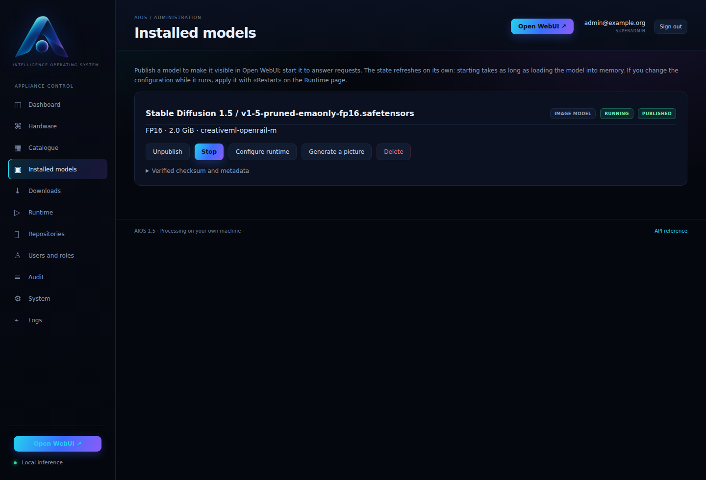

That button opens a small studio: a prompt, a size, the number of steps. The model is loaded on the first picture — a language model can stay loaded at the same time, since the two engines are separate — and the result appears in the page with the time it took.

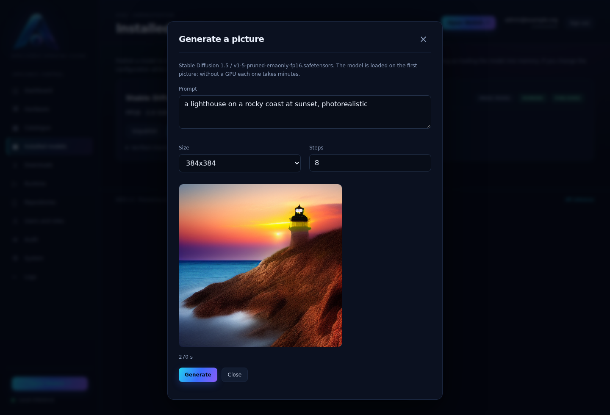

The same picture can be asked for from the chat's image button, or from any OpenAI client:

```bash
curl -k https://IP/v1/images/generations \
  -H "Authorization: Bearer <key>" -H "Content-Type: application/json" \
  -d '{"prompt":"a lighthouse at sunset, photorealistic","size":"512x512"}'
```

Without a GPU a 512×512 picture with 20 steps takes minutes rather than seconds: [image generation](image-generation.md) has the measured numbers and the trade-offs.

## 12. Use it from your own tools

The same model answers any OpenAI-compatible client. Read the key from the console (entry 6) or over recovery SSH, then:

```bash
curl -k https://IP/v1/models
curl -k https://IP/v1/chat/completions \
  -H "Authorization: Bearer <key>" -H "Content-Type: application/json" \
  -d '{"model":"<id>","messages":[{"role":"user","content":"What is 4+9?"}]}'
```

In n8n, use the *OpenAI Chat Model* node with base URL `https://IP/v1`, that key and the model `id`. See [the API guide](api.md) for the details and the limits.
